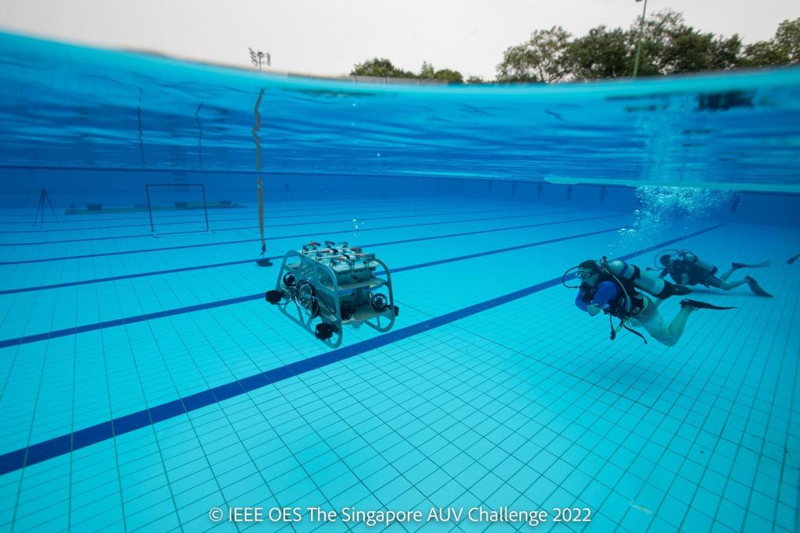

# Team Nirma AUV
This repository shows the work that I have done during my time at the Autonomous Underwater Vehicle Team at Nirma University, Ahmedabad, India. The code shown in the repository was utilized during the testing of the robot and in the competition! This included codes and frameworks for both the AUV and ROV. The team is currently ranked 1st Nationally (as of March 2023) at the National Remotely Operated Underwater Vehicle Competition (AMUROVc). The team was ranked 7th Internationally at the Singapore Autonomous Underwater Vehicle Challenge last year in May 2022.

  
  
 Agastya 1.0 
 

